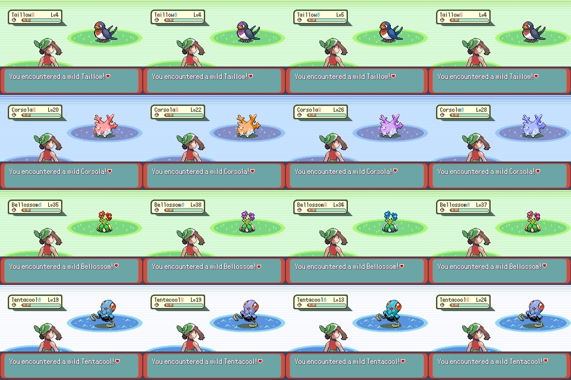
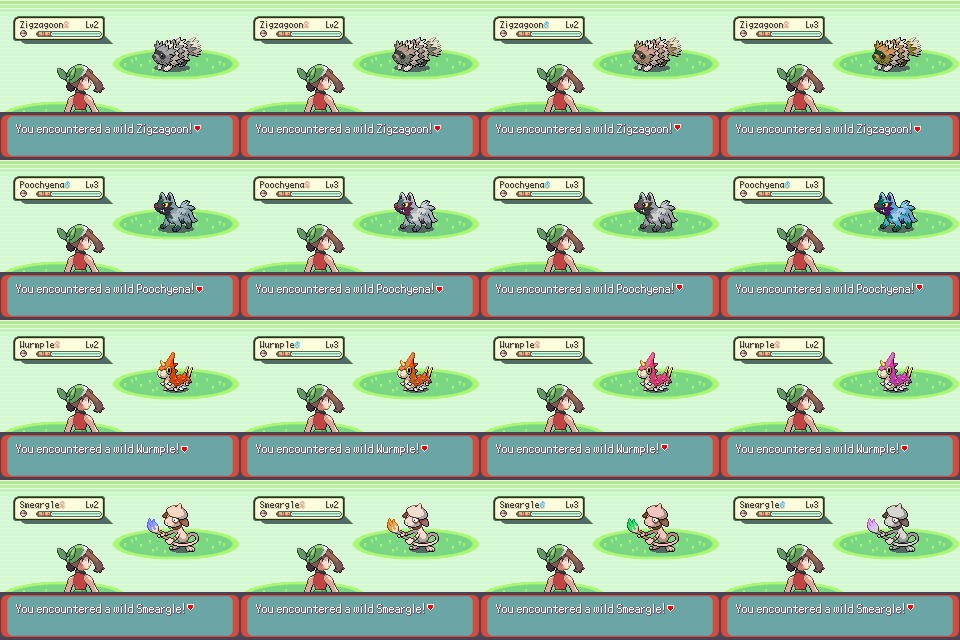
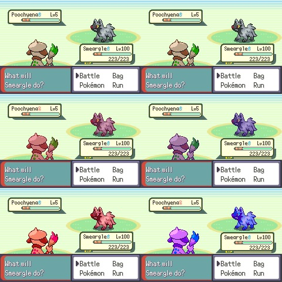
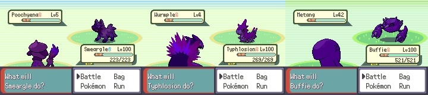
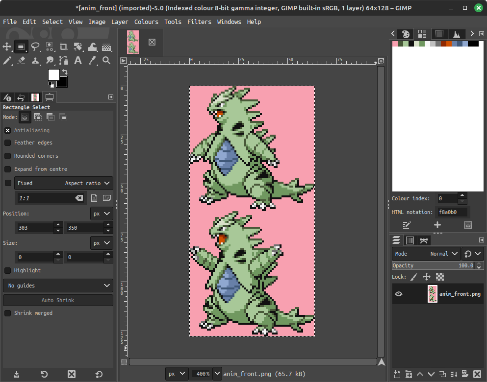
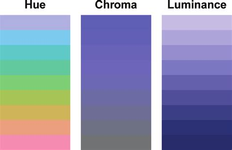
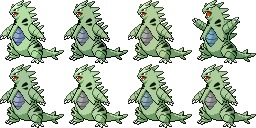
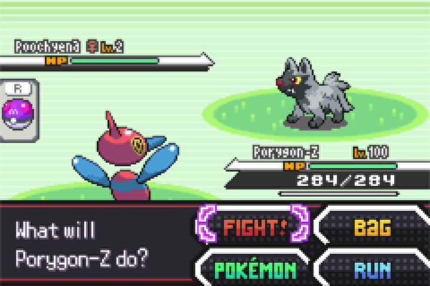

# `Variant Colours`
Implements programmatic palette shifting in the OkLCH (Polar OKLab) colour space to allow for easy, deterministic colour variations.



More information on OKLab: [https://bottosson.github.io/posts/oklab/](https://bottosson.github.io/posts/oklab/)



## Getting the changes

### Directly

Copy the files [variant_colours.c](./src/variant_colours.c) and [variant_colours.h](./include/variant_colours.h) and place them into the `src` / `include` folder of your project respectively.

### Via Git

Either pull this branch directly:

```bash
git pull https://github.com/SpaceOtter99/pokeemerald-expansion.git refs/heads/colour-variants
```

Or add this repo as a remote, pull the branch, then (optionally) delete the remote:
```bash
git remote add SpaceOtter https://github.com/SpaceOtter99/pokeemerald-expansion
git pull SpaceOtter colour-variants
git remote rm Spaceotter
```

## Getting it working

There are three main functions provided by the code.

### ApplyMonSpeciesVariantToPaletteBuffer
Takes in a mon's species, shiny flag, PID/personality and the loaded colour palette. Uses the mon's variant data as defined in [variant_colours.h](./include/variant_colours.h) and shifts the palette colours pseudo-randomly based on the PID. Of note - if a mon & its evolution have the same LCH values, the colours will be shifted by the same amount - which means your shifts will persist across evolutions if set up correctly.

To get this working automatically for pokemon front/back sprites in & out of battle, update the following file:

**[pokemon.c](./src/pokemon.c)**

First, rename `GetMonSpritePalFromSpecies` to `GetMonSpritePalFromSpeciesInternal`.

Then add/replace the following two functions:

```c
const u16 *GetMonSpritePalFromSpeciesAndPersonality(u16 species, bool32 isShiny, u32 personality)
{
    const u16 *base = GetMonSpritePalFromSpeciesInternal(species, isShiny, IsPersonalityFemale(species, personality));
    static u16 sVariantPal[16];
    CpuCopy16(base, sVariantPal, sizeof(sVariantPal));
    ApplyMonSpeciesVariantToPaletteBuffer(species, isShiny, personality, sVariantPal);
    return sVariantPal;
}

const u16 *GetMonSpritePalFromSpecies(u16 species, bool32 isShiny, bool32 isFemale)
{
    const u16 *base = GetMonSpritePalFromSpeciesInternal(species, isShiny, isFemale);
    static u16 sVariantPal[16];
    CpuCopy16(base, sVariantPal, sizeof(sVariantPal));
    ApplyMonSpeciesVariantToPaletteBuffer(species, isShiny, 0x00000000, sVariantPal);
    return sVariantPal;
}
```

To set up new species variant colours, add to the `gSpeciesVariants` array in [variant_colours.h](./include/variant_colours.h) - tutorial further down the page.

### ApplyPaletteVariantToPaletteBuffer

Similar to the above, but applies a pre-determined `PaletteVariant` to a given palette instead of automatically finding the palette given a species. I don't know when you'd use it, but it's exposed in case you do want to. (`ApplyMonSpeciesVariantToPaletteBuffer` calls it). It would be trivial to make an adaption of this function which averages L, C & H values of two colours by a coefficient the same way `BlendPalette` does in [util.c](./src/util.c) - this is left as an exercise to the reader as an alternative is presented below.

### ApplyCustomRestrictionToPaletteBuffer

Performs a similar functionality to [util.c](./src/util.c)'s `BlendPalette` function, but with a few differences. `BlendPalette` directly blends between two RGB values, encountering the exact issues OKLab aims to solve - colours often appear overly dark, light or desaturated; in some cases the colour itself is also lost due to strong opposing colours on the pokemon. `ApplyCustomRestrictionToPaletteBuffer` instead remaps the L, C or H to a given new range. Preserving L & C whilst varying the H range keeps the pokemon's contrast the same whilst changing its colours. Here's a comparison of a normal pokemon (first row), a `BlendPalette` (second row) and a `ApplyCustomRestrictionToPaletteBuffer` (third row).



Similarly, it is very easy to create unique variants of pokemon - for example, shadow pokemon:



## Adding new Pokemon Variations

(For use with ApplyMonSpeciesVariantToPaletteBuffer)

Inside of [variant_colours.h](./include/variant_colours.h), there is a table `gSpeciesVariants`. 

Firstly - identify the the species name inside of [species.h](./include/constants/species.h). For most pokemon this will just be the word 'SPECIES' followed by their name in caps. e.g., let's say we want to add a variant for Tyranitar - we'd use `SPECIES_TYRANITAR`.

This gets added to the array as:

```
    [SPECIES_TYRANITAR] = {
      
    },
```

To fill out the actual variation data, we need to know what we want to modify. Open up your pokemon's `anim_front` in an image editor that supports indexed palettes - e.g. [https://www.gimp.org/downloads/](https://www.gimp.org/downloads/). Look at the palette itself - in the example image, it's in the top right:



Let's say we want to vary Tyranitar's blue chest slightly. We can see that the blue colours start at index 11 (remember - the index counts up from 0), and carries on for 3 entries total. We can amend our array to add:

```
    [SPECIES_TYRANITAR] = {
      PAL1(11, 3),
    },
```

This means that the variation we're about to define will only apply to colours 11 - 13. A space-saving limitation is that the variations we define need to take place on 'chunks' of the palette. This usually isn't an issue for most pokemon - if it is, you can always rearrange the palette. We then need to decide what we want to vary, and by how much. We can choose from the following options:

- Hue: Represents the actual 'colour' of the image - e.g. red, blue, etc.
- Chroma: Represents how 'colourful' the image is - e.g. is it grey, or very vibrant?
- Luminance: Represents how bright the image is - e.g., is it dark, or very light?

Here's a helpful visualisation:



For this example, let's say we want to vary the colour slightly and the saturation a lot, keeping the luminance as it is. This will give us a range of colour between a slightly more purple tone to a slightly more teal tone, ranging from colourless grey to normal. In our array, this would look like:

```
    [SPECIES_TYRANITAR] = {
      PAL1(11, 3),
      HCL1(30, 25, 0, TRUE),
    },
```

There's two things to note here - firstly, our choices of HCL values are limited. To save on size in the event that data is added for a large number of pokemon, I've restricted the ranges you can pick from to a set of discrete values. For Hue, it's one of {0, 10, 20, 30, 45, 60, 90, 180}; and for Chroma/Luma it's {0, 5, 10, 25}. There is also the final argument, which is 'TRUE' here. This represents the mode that we're applying Chroma/Luma in. When 'False', the inputted range will act as normal - so our final colour would be the original C/L value +/- our HCL1 C/L values. However, when it's 'True', this means we're using 'decreasing only' mode - so the range instead becomes a number between the original C/L value and ( - 2 * our HCL1 C/L values). 

As another, quicker example - lets say we want Tyranitar's green body to vary between dark green & light green slightly. We can look at the palettes again (Green from 1 to 5), and add in the following to our array:

```
    [SPECIES_TYRANITAR] = {
      PAL1(11, 3),
      HCL1(30, 25, 0, TRUE),
      PAL2(1, 5),
      HCL2(0, 0, 10, FALSE),
    },
```

Another note - each pokemon can have at most two entries (so in this case, there's nothing else we can do for Tyranitar!).

Compiling this, we can see how Tyranitar looks in the game now:



We've mostly achieved what we wanted - the Tyranitar have multiple slight differences in their green skin colour, and the chest is varying colours of blue with saturation down to grey. It's then easy to further refine this if we wanted to make any more changes - just edit the variables in the array!
# Gen 5 Black/White Battle UI

This branch replaces the battle interface with the one
from Pokémon Black and White. It contains the battle UI and nothing else, so it can be
merged into an existing project on its own. Battle backgrounds are left alone.

| | |
| --- | --- |
|  |  |

## Configuration

Everything lives in `include/config/bw_battle_ui.h`:

| Setting | Default | What it does |
| --- | --- | --- |
| `BW_BATTLE_UI` | `TRUE` | Master switch for everything below. |
| `BW_BATTLE_UI_TEXTBOX` | `TRUE` | The BW message box. |
| `BW_BATTLE_UI_INPUTBOX` | `TRUE` | The action box, move box and cursor. Requires the textbox. |

Turning the textbox off returns the lower half of the screen to the Gen 3 look. Turning
off only the input box keeps the BW message box but restores the Gen 3 menus. The
healthboxes and type icons are a separate port and are **not** switched off by any of
these, so the top half stays BW either way.

Type icons are controlled by expansion's own `B_SHOW_TYPES` in `include/config/battle.h`,
which this branch sets to `SHOW_TYPES_ALWAYS`.

One requirement to be aware of: `B_MOVE_REARRANGEMENT_IN_BATTLE` must be `GEN_4` or later,
which is the expansion default. The BW move box has nowhere to show the Gen 3 move
swapping prompt, so a lower setting stops the build with an explanatory error rather than
producing a broken menu.

## Credits

Almost none of this is my own work. It is a port, and it exists because of:

- **[EternalCode](https://github.com/PlatinumMaster/EternalCode-BWHealthBars-BPRE)** for the
  original Black/White health bar design, graphics and FireRed implementation.
- **[PlatinumMaster](https://github.com/PlatinumMaster)** for maintaining a buildable
  source of that health bar implementation.
- **[NicoSwag](https://github.com/NicoSwag/pokeemerald-expansion/tree/nicos_cool_ui)** for
  the Nico's Cool UI battle type-icon artwork and layout.
- **[mudskipper13](https://github.com/mudskipper13/pokeemerald/tree/feature/bwBattleUI)** for
  the Black/White message box, action box, move box and cursor, and the outlined battle
  UI font.

If you use this branch, please credit myself and all of the above.

---

# About `pokeemerald-expansion`

  

<!-- If you want to re-record or change these gifs, here are some notes that I used: https://files.catbox.moe/05001g.md -->

**`pokeemerald-expansion`** is a GBA ROM hack base that equips developers with a comprehensive toolkit for creating Pokémon ROM hacks. **`pokeemerald-expansion`** is built on top of [pret's `pokeemerald`](https://github.com/pret/pokeemerald) decompilation project. **It is not a playable Pokémon game on its own.**

# [Features](FEATURES.md)

**`pokeemerald-expansion`** offers hundreds of features from various [core series Pokémon games](https://bulbapedia.bulbagarden.net/wiki/Core_series), along with popular quality-of-life enhancements designed to streamline development and improve the player experience. A full list of those features can be found in [`FEATURES.md`](FEATURES.md).

# [Credits](CREDITS.md)

 [](CREDITS.md)

If you use **`pokeemerald-expansion`**, please credit **RHH (Rom Hacking Hideout)**. Optionally, include the version number for clarity.

```
Based off RHH's pokeemerald-expansion 1.16.2 https://github.com/rh-hideout/pokeemerald-expansion/
```

Please consider [crediting all contributors](CREDITS.md) involved in the project!

# Choosing `pokeemerald` or **`pokeemerald-expansion`**

- **`pokeemerald-expansion`** supports multiplayer functionality with other games built on **`pokeemerald-expansion`**. It is not compatible with official Pokémon games.
- If compatibility with official games is important, use [`pokeemerald`](https://github.com/pret/pokeemerald). Otherwise, we recommend using **`pokeemerald-expansion`**.
- **`pokeemerald-expansion`** incorporates regular updates from `pokeemerald`, including bug fixes and documentation improvements.

# [Getting Started](INSTALL.md)

❗❗ **Important**: Do not use GitHub's "Download Zip" option as it will not include commit history. This is necessary if you want to update or merge other feature branches.

If you're new to git and GitHub, [Team Aqua's Asset Repo](https://github.com/Pawkkie/Team-Aquas-Asset-Repo/) has a [guide to forking and cloning the repository](https://github.com/Pawkkie/Team-Aquas-Asset-Repo/wiki/The-Basics-of-GitHub). Then you can follow one of the following guides:

## 📥 [Installing **`pokeemerald-expansion`**](INSTALL.md)
## 🏗️ [Building **`pokeemerald-expansion`**](INSTALL.md#Building-pokeemerald-expansion)
## 🚚 [Migrating from **`pokeemerald`**](INSTALL.md#Migrating-from-pokeemerald)
## 🚀 [Updating **`pokeemerald-expansion`**](INSTALL.md#Updating-pokeemerald-expansion)

# [Documentation](https://rh-hideout.github.io/pokeemerald-expansion/)

For detailed documentation, visit the [pokeemerald-expansion documentation page](https://rh-hideout.github.io/pokeemerald-expansion/).

# [Contributions](CONTRIBUTING.md)
If you are looking to [report a bug](CONTRIBUTING.md#Bug-Report), [open a pull request](CONTRIBUTING.md#Pull-Requests), or [request a feature](CONTRIBUTING.md#Feature-Request), our [`CONTRIBUTING.md`](CONTRIBUTING.md) has guides for each.

# [Community](https://discord.gg/6CzjAG6GZk)

[](https://discord.gg/6CzjAG6GZk)

Our community uses the [ROM Hacking Hideout (RHH) Discord server](https://discord.gg/6CzjAG6GZk) to communicate and organize. Most of our discussions take place there, and we welcome anybody to join us!
### Start Menu Clock

_Written for pokeemerald-expansion 1.7.X_

Adds a clock that tracks the in-game time to the start menu, as seen below. There are comments in the branch if you're interested in full day names vs shortened day names.


